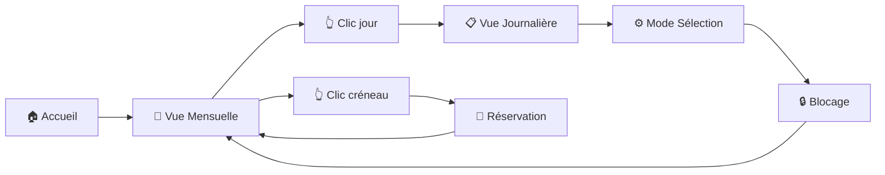

# 📅 Calendrier de Réservations Horaires

> Interface administrateur simple et élégante pour gérer vos rendez-vous par créneaux horaires

<div align="center">
  
  
  
  
  
  
  
</div>

## ✨ Fonctionnalités

<table>
<tr>
<td width="50%">

### 🔥 **Réservations**
- ⏰ Créneaux d'1 heure (8h-20h)
- 👤 Infos client complètes
- ✏️ Modification instantanée
- 🗑️ Suppression facile

</td>
<td width="50%">

### 🚀 **Blocage Intelligent**
- 🎯 Sélection multiple
- 🌅 Blocage matinée/après-midi
- 📅 Journée complète
- 🔒 Raisons personnalisées

</td>
</tr>
</table>

## 🎨 Interface

```
📱 Vue Mensuelle    →    📋 Vue Journalière    →    ⚙️ Mode Sélection
    ┌─────────┐           ┌─────────────┐           ┌─────────────┐
    │ 🟢 Libre │           │  8:00 Libre │           │ 🟠 Sélection│
    │ 🔴 Occupé│     →     │  9:00 Réservé│    →     │ 🔴 Réservé  │
    │ ⚫ Bloqué│           │ 10:00 Bloqué│           │ ⚫ Bloqué   │
    └─────────┘           └─────────────┘           └─────────────┘
```

## ⚡ Démarrage Rapide

```bash
# 1. Télécharger le fichier
📥 calendar.html

# 2. Ouvrir dans le navigateur
🌐 Double-clic sur le fichier

# 3. C'est prêt ! 🎉
```

## 🛠️ Personnalisation

<details>
<summary><b>🕐 Modifier les horaires</b></summary>

```javascript
// Changer les créneaux (ex: 9h-17h)
const timeSlots = [];
for (let i = 9; i <= 17; i++) {
    timeSlots.push(`${i}:00`);
}
```

</details>

<details>
<summary><b>🎨 Changer les couleurs</b></summary>

```css
:root {
    --libre: #ecf0f1;      /* Gris clair */
    --reserve: #e74c3c;    /* Rouge */
    --bloque: #95a5a6;     /* Gris */
    --selection: #f39c12;  /* Orange */
}
```

</details>

<details>
<summary><b>📱 Créneaux vue mensuelle</b></summary>

```javascript
// Modifier les créneaux affichés
const mainSlots = ['9:00', '13:00', '16:00', '19:00'];
```

</details>

## 📊 Statistiques

<div align="center">

| Métrique | Valeur |
|----------|--------|
| 📝 **Lignes de code** | ~800 |
| ⚡ **Temps de chargement** | < 1s |
| 📱 **Compatibilité** | 95%+ navigateurs |
| 🎯 **Créneaux/jour** | 13 (8h-20h) |

</div>

## 🔄 Workflow



## 🚀 Roadmap

- [ ] 💾 Sauvegarde automatique
- [ ] 📧 Notifications email
- [ ] 📊 Statistiques avancées
- [ ] 🌙 Mode sombre
- [ ] 📱 App mobile
- [ ] 🔄 Synchronisation cloud

## 🤝 Contribution

Envie d'améliorer le projet ? 
1. 🍴 Fork le repository
2. 🔧 Créez votre feature
3. 📤 Pull request

## 📞 Support

💬 **Contact** : https://linktr.ee/lcsbarber

---

<div align="center">
  
**⭐ Star ce projet si il vous aide !**


</div>
